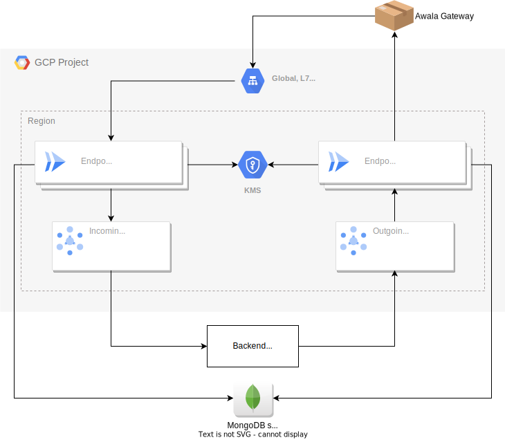

# `relaycorp/awala-endpoint/google`

This is a Terraform module to manage an instance of the [Awala Internet Endpoint](https://docs.relaycorp.tech/awala-endpoint-internet/) on Google Cloud Platform (GCP) using serverless services in the same region.

The module is responsible for all the resources needed to run the endpoint app on GCP, except for the following (which you can deploy to any cloud and any region):

- The backend app.
- The MongoDB server.
- The DNS records.

The [following diagram](https://github.com/relaycorp/terraform-google-awala-endpoint/blob/main/diagrams/cloud.svg) illustrates the cloud architecture created by this module:



## Prerequisites

- A GCP project with billing and the [Cloud Resource Manager API](https://console.developers.google.com/apis/api/cloudresourcemanager.googleapis.com/overview) enabled.
- A domain name with DNSSEC correctly configured.
- A MongoDB server reachable from the Cloud Run resources.
- The backend app (which will communicate with the endpoint via Google Pub/Sub).

## Instructions

1. Enable the required service APIs and initialise this module in a new module. For example:
   ```hcl
      locals {
         services = [
            "run.googleapis.com",
            "compute.googleapis.com",
            "cloudkms.googleapis.com",
            "pubsub.googleapis.com",
            "secretmanager.googleapis.com",
            "iam.googleapis.com",
         ]
      }

      resource "google_project_service" "services" {
         for_each = toset(local.services)

         project                    = local.project_id
         service                    = each.value
         disable_dependent_services = true
      }

     module "awala-endpoint" {
       source  = "relaycorp/awala-endpoint/google"
       version = "<INSERT VERSION HERE>"
   
       # ... Specify the variables here...
     }
   ```
   [See full example](examples/basic).
2. Run `terraform init`, followed by `terraform apply`.
3. Execute the bootstrapping script as follows:
   ```shell
   gcloud --project=PROJECT --region=REGION run jobs execute \
     "$(terraform output bootstrap_job_name)" \
     --wait
   ```
4. Create the following DNS records:
   - `A` record for the load balancer, whose IPv4 address can be found in the output variable `pohttp_server_ip_address`.
   - `SRV` record for the A record above, so that it can be used as an _Awala Parcel-Delivery Connection (PDC)_ server. For example:
     ```
     _awala-pdc._tcp.your-domain.com. 3600 IN SRV 0 0 443 pohttp-server.your-domain.com.
     ```
5. Configure your backend app to subscribe to incoming messages on the topic found in the output `pubsub_topics.incoming_messages`, and to publish outgoing messages to the topic `pubsub_topics.outgoing_messages`.

## Dead lettering

PubSub is configured to attempt to deliver messages to Awala Internet Gateways up to 10 times. When this limit is reached, the message is moved to a [dead letter topic](https://www.enterpriseintegrationpatterns.com/patterns/messaging/DeadLetterChannel.html).

The name of the dead letter topic is available as the output variable `pubsub_topics.outgoing_messages_dead_letter`. [Refer to the GCP documentation to learn how to handle such messages](https://cloud.google.com/pubsub/docs/handling-failures).

## Architectural decisions

We had to create a load balancer because Cloud Run's domain name (`run.app`) does not support DNSSEC. As of this writing, Cloud Run offers an invite-only feature to use custom domain names, so we may switch to it if it supports DNSSEC once it reaches General Availability status.
